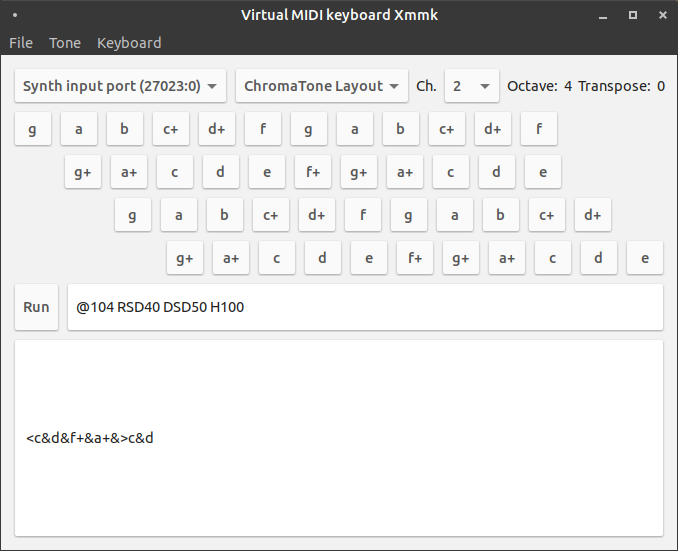

# Xmmk: cross-platform virtual MIDI keyboard

Xmmk is a tiny virtual MIDI keyboard application based on managed-midi API.

It used to be almost all about managed-midi API dogfooding, but now it is designed to easily try out any note on your MIDI devices, either normal instruments or drums. It has become featureful.

**Keyboard layouts:** It supports two PC keyboard layout modes

- Piano - that you know. When there is no half note e.g. `e-sharp` or `b-sharp` then there is no corresponding key.
- ChromaTone - every key has an assigned note. That means, the key right next to `e` is `f+` because `f` is placed on right-upper next to `e`.

 (And, the layout basis is weird - I only have JP106 keyboard so only alphabets are likely to work as expected.)

** Recorded as MML:** When you type "notes" then they will be recorded at the text entry box, as simple MML. When it was typed while there are other notes, then there will be `&` meaning that they consist of chord notes.

** Control octaves and keys:** SHIFT+UP increases octave, SHIFT+DOWN decreases it. SHIFT+LEFT decreases transpose, SHIFT+RIGHT increases it.

** Drum part:** You can also choose "channel 10" which usually means a drum channel. For channel 10, it will show drum set names instead of instruments.

** MIDI instrument database:** the instruments list is automatically guessed from your device port name. You can also override the instruments set from our presets (instruments and drums have different mappings).

** Control MIDI output through MML:** you can directly control MIDI device by sending operations in [mugene](https://github.com/atsushieno/mugene/) MML syntax so that you can adjust volumes, effect parameters, pitch bends etc.
